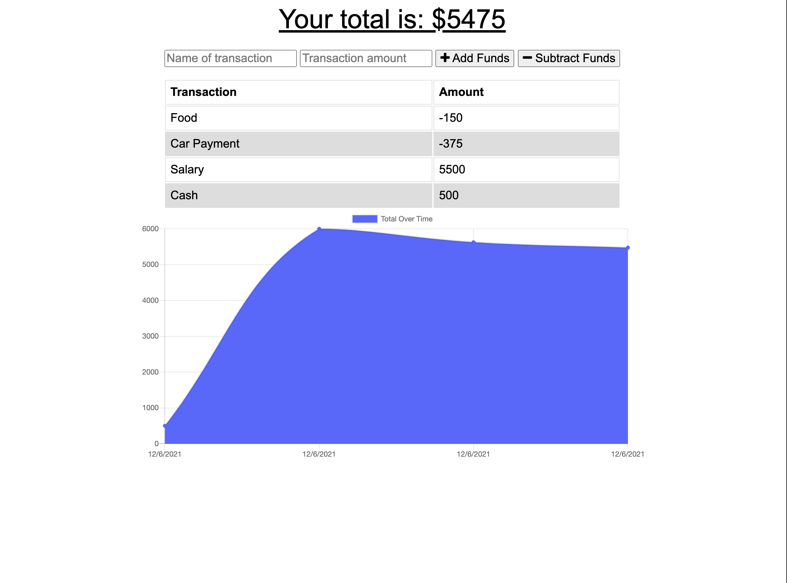

# 19-PWA-Online-Offline-Budget-Trackers

This is the backend of the budget tracker that was connected to an exsiting frontend

# Table of Contents

|                               |                         |
| ----------------------------- | ----------------------- |
| [GitHub Links](#github-links) | [Questions](#questions) |
| [Installation](#installation) | [License](#license)     |
| [Test](#test)                 | [Credits](#credits)     |
| [Usage](#usage)               |                         |
|                               |                         |

# Installation

Open terminal/gitbash and run the following:

```
  npm install
```

## Usage

To start please run the following in terminal/gitbash:

```
  npm start
```

## Here is a preview of Budget Tracker!



# GitHub Links

Project depoyment [Link](https://gttrackerbudget.herokuapp.com/?usp=sharing)<br>
Project Repository [Link](https://github.com/jeffcela/19-PWA-Online-Offline-Budget-Trackers)

## Questions

Please direct any questions to jeffcela@gmail.com

# Contributing

Please refer to each project's style and contribution guidelines for submitting patches and additions. In general, we follow the "fork-and-pull" Git workflow.

1. Fork the repo on GitHub
2. Clone the project to your own machine
3. Commit changes to your own branch
4. Push your work back up to your fork
5. Submit a Pull request so that we can review your changes

# Credits

_This homework assignment was completed in VS Code and Terminal by Jeff Cela
© 2021 Trilogy Education Services, LLC, a 2U, Inc. brand. Confidential and Proprietary. All Rights Reserved.

# License

[](https://shields.io)
